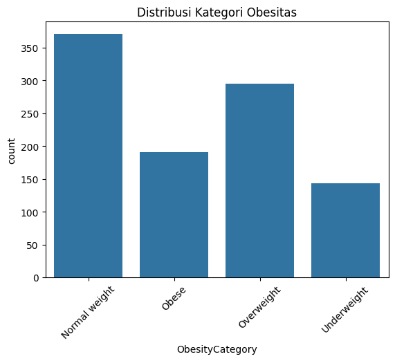
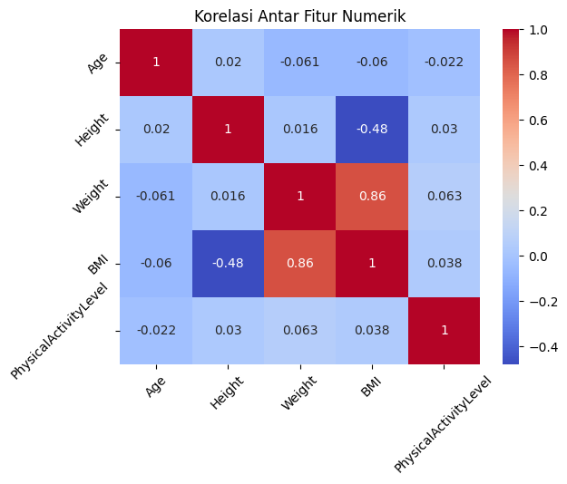
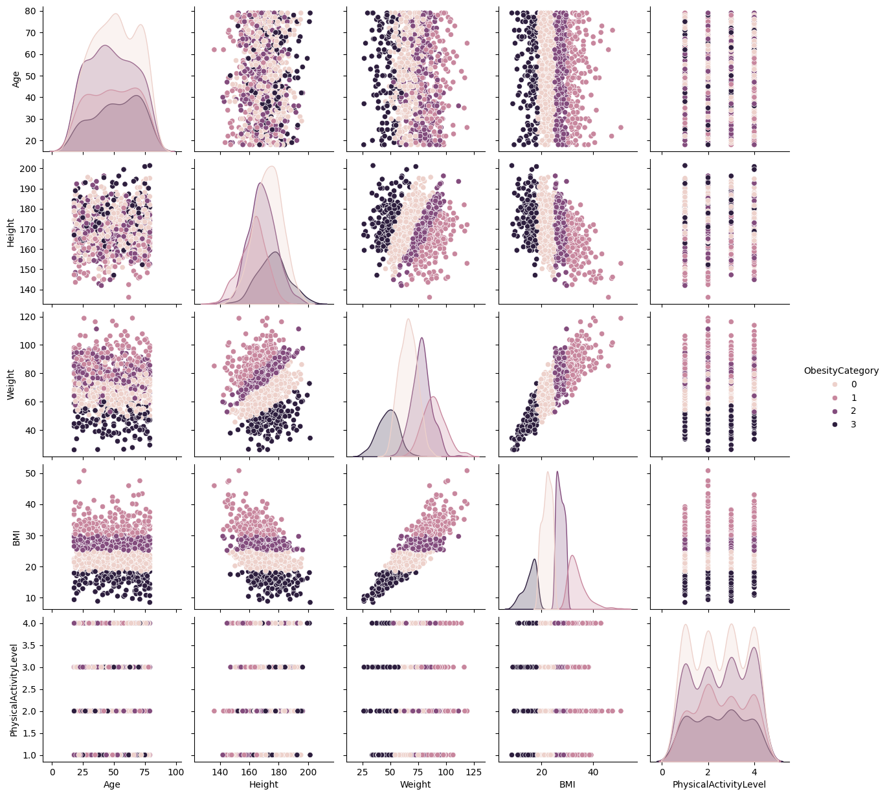

# Laporan Proyek Machine Learning - Bagus Angkasawan Sumantri Putra

## Domain Proyek

Obesitas adalah masalah kesehatan yang makin mengkhawatirkan secara global dan mendesak untuk diatasi. Menurut WHO, pada tahun 2016 lebih dari 1,9 miliar orang dewasa mengalami kelebihan berat badan, dan lebih dari 650 juta di antaranya mengalami obesitas. Kondisi ini meningkatkan risiko penyakit kronis seperti diabetes, jantung, dan kanker. Karena itu, pendeteksian dini tingkat obesitas menjadi semakin penting untuk mencegah komplikasi serius di masa depan. 

Penerapan machine learning dalam klasifikasi obesitas berdasarkan atribut personal seperti usia, jenis kelamin, tinggi badan, berat badan, BMI, dan tingkat aktivitas fisik menawarkan solusi cepat dan akurat untuk mempercepat intervensi medis atau gaya hidup.

**Referensi:**
- [World Health Organization - Obesity and Overweight](https://www.who.int/news-room/fact-sheets/detail/obesity-and-overweight)

## Business Understanding

### Problem Statements
- Bagaimana mengklasifikasikan tingkat obesitas seseorang berdasarkan data personal dan aktivitas fisiknya?
- Model machine learning apa yang paling akurat dalam melakukan klasifikasi ini?

Permasalahan ini penting untuk segera diselesaikan, mengingat angka obesitas dunia yang terus meningkat dan dampaknya terhadap kualitas hidup serta biaya kesehatan jangka panjang. Solusi yang cepat dan tepat melalui model prediksi dapat berperan besar dalam strategi pencegahan.

### Goals
- Membuat model klasifikasi obesitas yang efektif dan akurat.
- Membandingkan performa berbagai model machine learning untuk memilih model terbaik.

### Solution Statements
- Menggunakan algoritma Logistic Regression, Random Forest, dan SVM untuk membangun model klasifikasi.
- Melakukan preprocessing dan tuning untuk meningkatkan performa model.
- Menggunakan classification report, confusion matrix, dan akurasi sebagai metrik evaluasi.

## Data Understanding

Dataset yang digunakan berasal dari [Kaggle - Obesity Level Prediction Dataset](https://www.kaggle.com/datasets/mrsimple07/obesity-prediction).

### Variabel dalam dataset:
- `Gender` : Jenis kelamin (Male/Female)
- `Age` : Usia
- `Height` : Tinggi badan (meter)
- `Weight` : Berat badan (kg)
- `BMI` : Body Mass Index
- `PhysicalActivityLevel` : Tingkat aktivitas fisik
- `ObesityCategory` : Kategori obesitas (target)

### Exploratory Data Analysis (EDA)
- Tidak ada missing value ditemukan.
- Distribusi kategori `ObesityCategory` cenderung tidak seimbang.
- Korelasi kuat antara `Weight` dan `BMI` ditemukan.

**Visualisasi:**

1. **Distribusi Kategori Obesitas**  
     
   **Penjelasan:** Plot batang di atas menunjukkan distribusi kategori obesitas dalam dataset. Terlihat bahwa kategori 'Normal weight' dan 'Overweight' memiliki jumlah data yang paling banyak, sementara kategori 'Underweight' memiliki jumlah data yang paling sedikit. Hal ini mengindikasikan bahwa dataset mungkin sedikit tidak seimbang.

2. **Korelasi Antar Fitur Numerik**  
     
   **Penjelasan:** Heatmap di atas memvisualisasikan korelasi antar fitur numerik dalam dataset. Dari heatmap, dapat dilihat bahwa terdapat korelasi positif yang kuat antara 'Weight' dan 'BMI', yang sesuai dengan definisi BMI yang dihitung berdasarkan berat badan dan tinggi badan. Beberapa fitur lainnya juga menunjukkan korelasi, meskipun tidak sekuat antara 'Weight' dan 'BMI'.

3. **Hubungan Antar Fitur Numerik (Pairplot)**  
     
   **Penjelasan:** Pairplot di atas menggambarkan hubungan antara beberapa fitur numerik dan kategori obesitas. Terlihat bahwa individu dengan 'Weight' dan 'BMI' yang lebih tinggi cenderung berada pada kategori obesitas yang lebih tinggi. Selain itu, fitur-fitur seperti 'Age', 'Height', dan 'PhysicalActivityLevel' juga menunjukkan variasi yang berbeda di setiap kategori obesitas.

## Data Preparation

Langkah yang dilakukan:
- **Encoding**: Label Encoding pada kolom kategorikal seperti `Gender` dan `ObesityCategory`.
- **Scaling**: Standardisasi fitur numerik menggunakan StandardScaler.
- **Splitting**: Membagi data menjadi training dan testing set (80%:20%).

Tahapan ini penting untuk memastikan model dapat bekerja optimal, khususnya model SVM yang sensitif terhadap skala data.

## Modeling

Model yang digunakan:
1. **Logistic Regression**
2. **Random Forest Classifier**
3. **Support Vector Machine (SVM)**

**Keterangan:**
- Logistic Regression dijadikan baseline model.
- Random Forest dipilih karena kekuatannya dalam menangani data kompleks dan mengurangi overfitting.
- SVM digunakan untuk menangani klasifikasi dengan margin maksimal.

Dalam hal ini, **Random Forest** dipilih sebagai model terbaik karena memberikan akurasi tertinggi (99.5%) bahkan sebelum tuning. Meskipun Logistic Regression juga memberikan performa yang sangat baik dengan akurasi 97%, Random Forest lebih stabil dalam menangani kompleksitas data dan dapat mengurangi kemungkinan overfitting dengan banyaknya pohon yang digunakan.

## Evaluation

Metrik evaluasi yang digunakan:
- **Accuracy**: Untuk mengukur seberapa banyak prediksi yang benar dari keseluruhan data. Cocok digunakan karena fokus utama adalah klasifikasi multi-kelas dengan distribusi kategori yang relatif mirip setelah balancing.
- **Precision** dan **Recall**: Untuk memahami seberapa baik model mengidentifikasi masing-masing kategori obesitas, terutama penting agar tidak ada kategori yang diabaikan atau salah klasifikasi fatal.
- **F1-Score**: Karena data memiliki sedikit ketidakseimbangan antar kelas, F1-score menjadi metrik penting untuk menangkap keseimbangan antara precision dan recall.
- **Confusion Matrix**: Untuk visualisasi kesalahan dan benar pada masing-masing kategori obesitas.

### Formula Metrik:
- **Accuracy**: Persentase prediksi yang benar dibandingkan dengan total data.  
  Formula:  
  `Accuracy = (True Positives + True Negatives) / Total Samples`

- **Precision**: Mengukur akurasi dari prediksi yang positif.  
  Formula:  
  `Precision = True Positives / (True Positives + False Positives)`

- **Recall (Sensitivity)**: Mengukur seberapa baik model menangkap kelas positif yang sesungguhnya.  
  Formula:  
  `Recall = True Positives / (True Positives + False Negatives)`

- **F1-Score**: Rata-rata harmonis dari Precision dan Recall.  
  Formula:  
  `F1-Score = 2 * (Precision * Recall) / (Precision + Recall)`

### Hasil Evaluasi Awal

Tiga model dibandingkan, yaitu Logistic Regression, Random Forest, dan Support Vector Machine (SVM).

| Model               | Precision | Recall | F1-Score | Akurasi |
|---------------------|-----------|--------|----------|---------|
| Logistic Regression | 0.97      | 0.96   | 0.97     | 0.97    |
| Random Forest       | 1.00      | 0.99   | 0.99     | 0.995   |
| SVM                 | 0.94      | 0.92   | 0.93     | 0.93    |

**Confusion Matrix:**

- **Logistic Regression**
  ```
  [[74  0  0  0]
   [ 0 37  1  0]
   [2  0 57  0]
   [3  0  0 26]]
  ```
- **Random Forest**
  ```
  [[74  0  0  0]
   [0 37  1  0]
   [0  0 59  0]
   [0  0  0 29]]
  ```
- **SVM**
  ```
  [[69  0  4  1]
   [0 37  1  0]
   [2  1 56  0]
   [5  0  0 24]]
  ```

### Analisis Perbandingan Model

- **Random Forest** menunjukkan performa terbaik di semua metrik, dengan akurasi hampir sempurna (99.5%), precision dan recall tinggi, serta error yang sangat minim.
- **Logistic Regression** juga berkinerja baik, namun terdapat kesalahan klasifikasi pada kelas "Underweight" dan "Obesity".
- **SVM** menunjukkan performa yang cukup baik namun sedikit lebih rendah dibandingkan dua model lainnya, terutama pada prediksi kelas "Underweight".

**Kesimpulan:**  
Random Forest dipilih sebagai model utama untuk tahap tuning lebih lanjut karena menghasilkan performa terbaik dibandingkan model lainnya.

### Tuning dan Evaluasi Random Forest

Dilakukan tuning pada:
- `n_estimators = 200`
- `max_depth = 10`
- `random_state = 42`

Setelah tuning, performa model tetap sangat tinggi:

- **Accuracy**: 0.995
- **F1-score**: Nyaris sempurna di semua kategori.
- **Confusion Matrix**: Tidak ada perubahan signifikan; model tetap mengklasifikasikan hampir seluruh data dengan akurat.

**Confusion Matrix Tuned Random Forest:**
```
[[74  0  0  0]
 [ 0 37  1  0]
 [ 0  0 59  0]
 [ 0  0  0 29]]
```

**Kesimpulan Evaluasi:**
- Model **Random Forest** terbukti paling efektif dalam mengklasifikasikan tingkat obesitas berdasarkan data personal dan aktivitas fisik.
- Model mencapai **akurasi sebesar 99.5%** dan **F1-score yang sangat tinggi** di seluruh kategori obesitas.
- Metrik evaluasi menunjukkan:
  - **Accuracy** tinggi, menandakan performa prediksi secara keseluruhan sangat baik.
  - **Precision** dan **Recall** tinggi di semua kelas, menunjukkan model mampu mengidentifikasi kategori obesitas dengan konsisten dan minim kesalahan.
- Dengan hasil ini, **model dapat diandalkan sebagai alat prediksi obesitas** yang cepat dan akurat untuk mendukung upaya pencegahan penyakit terkait obesitas.
